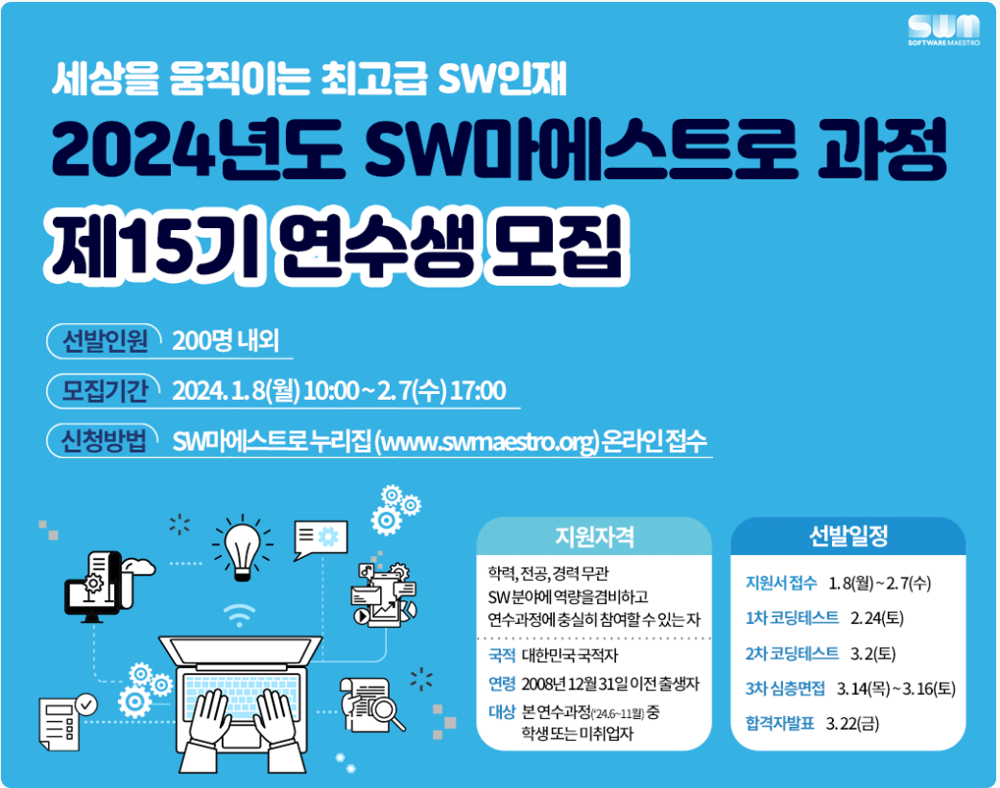

# 소프트웨어 마에스트로 코딩테스트 대비
　  
  

★ 2.24(토) 1차 코딩 테스트 ★　  
★ 3.2(토) 2차 코딩 테스트 ★　  
★ 3.14(목)~3.16(토) 3차 심층면접 ★　  
★ 3.22(금) 합격자 발표 ★　  

[목표]　  
프로그래머스 SQL 문제 모두 해결　  
SQL 정리　  
SQL 암기　  
백준 알고리즘 매일 최소 5문제 해결 (실버, 골드)　  
알고리즘별 간단한 이론 정리　  
알고리즘별 코드 정리 　  
이론, 코드 암기　  

## 커밋 컨벤션

> 기본 형태
~~~
type: subject

body
~~~
　   
> type

feat: 새로운 기능　   
fix: 버그 수정　   
docs: 문서 수정　   
style: 서식 지정, 세미콜론 누락 등 (코드 변경 없음)　   
refactor: 코드 리팩토링　   
test: 테스트 코드 추가, 테스트 코드 리팩토링 (생산 코드 변경 없음)　   
chore: 빌드, 패키지 매니저 등 업데이트  (생산 코드 변경 없음)　   
　   

