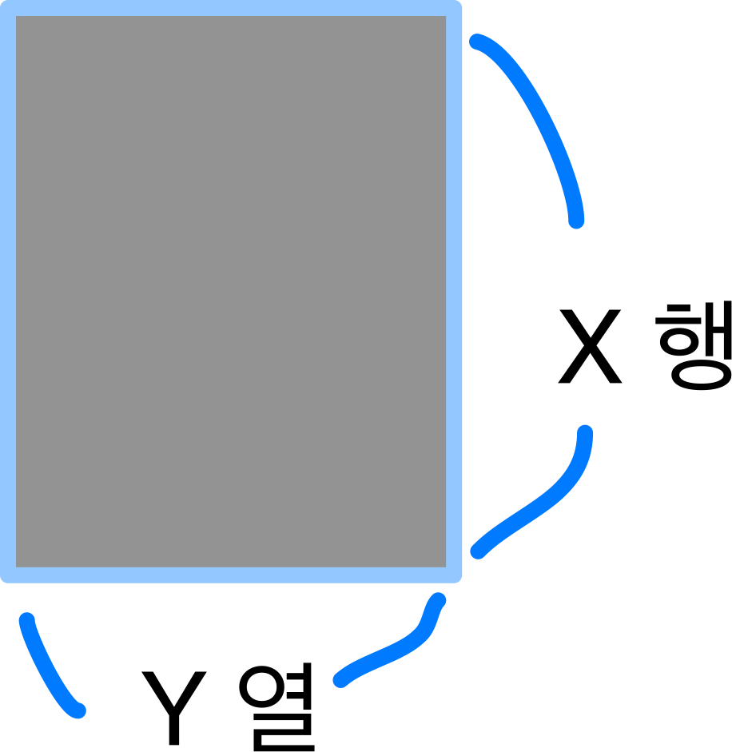
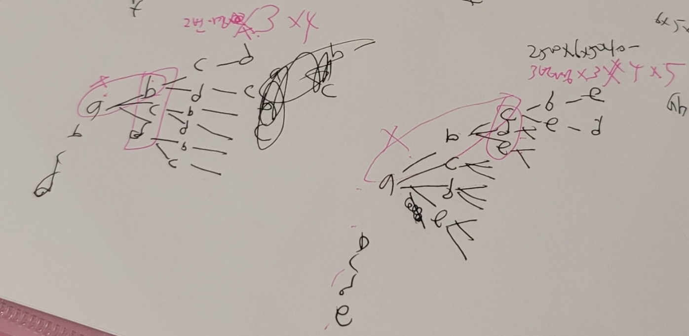

- [#[스택]](#[스택])
- [#[큐]](#[큐])
***

[14기]
- 1차
1) 구현
2) Brute Force/BackTracking/DFS/BFS
3) 조합, BFS
4) BFS (그리디)
5) SQL - 문자열(정규식)

- 2차
1) 스택
2) 그리디, 시뮬레이션
3) 구현, deque
4) 다익스트라/플로이드워셜
5) SQL - JOIN, UNION ALL

---

[13기]
- 1차
1) 구현
2) 빡구현
3) 조합
4) 정렬, 인덱싱
5) DFS

- 2차
1) 구현
2) brute force
3) Union-Find, BFS, DFS
4) DP

---

[12기]
- 1차
1) DFS
2) BRUTE FORCE
3) 투포인터
4) 구현
5) 분할정복
6) DP
7) 그리디

- 2차
1) DFS/BFS
2) 분할정복
3) 재귀

---

[11기]
- 1차
1) 구현
2) 그리디
3) BFUTE FORCE
4) BFS

- 2차
1) DP
2) BFS/DFS
3) UNION-FIND
4) 라인 스위핑
5) BRUTE FORCE
6) 정렬

***

최소한 기출된 모든 알고리즘은 구현 가능해야 함
+) 이분탐색?
+) MST(최소 신장 트리)?
+) dp(냅색)?

***

[전략]
- 문제 푸는 시간 제한이 있기에 5번 먼저 풀고, 알고리즘 중 쉬운 거 먼저. 풀 문제 버릴 문제 잘 골라야 함.
- 문제 꼭 요약하고 정리하기. 조건 제발 꼼꼼히 보자. 예시 꼼꼼히 보기. SQL도 마찬가지.
- 어떤 알고리즘 사용할지 생각해보기
- 특히 n=1인 경우 등에 대해 테스트 케이스 꼭 추가로 만들기
- n=1인 경우에 대해서는 잘 생각하고 있어. 다만 "최댓값"에 대해 정확히 조사하자!!!! 이거 때문에 틀린 문제 '다리를 지나는 트럭'
- => 개선법. 미리 정해놓는 리스트의 크기를 변수값을 활용해서!
- 시간복잡도 제한은 빡빡하지 않은 편이므로 10초도 괜찮다 생각하고 정확하게 안전하게 구현하기!!
- 한 문제를 풀더라도 제대로 풀자! 이렇게 풀었는데 시간이 부족하다면 내가 부족한거다! 그렇다면 시간을 줄일 다른 방법을 찾아야 하는 거지! 문제 하나를 꼼꼼하지 않게 푼다고 되는 게 아니다!
- ⭐️ 중간에 break가 되는 경우, 따로 bool형 변수를 둬서 False인 경우 무조건 ans을 0으로 주는 코드를 추가하는 걸 고려하자
- 변수명은 가급적이면 중복적이게 쓰지 말자! 혹시 모르는 실수 발생을 방지하기 위해!
  컴파일러가 못 걸러준다. 단순 for문이더라도!
  map같이 예약어를 절대 변수로 쓰지 말자
- 중첩 반복문 쓸 때 반복문 변수 주의하기
- 구현 코드가 길어질수록 변수 오타 없는지 여러 번!! 꼼꼼히 확인할 것
- 가급적 복붙하지 말고 직접 타이핑하기! 복붙하면서 안바꾸는 변수때문에 틀리기 쉬워서 그럼!
- 클린 코드 개나 주자. 일단 푸는 것이 중요하다.
- 무작정 코드 짜기를 시작한다고 정답이 나오는 게 아니다. 
  글로 풀이를 확실하게!!! 설명할 수 있는 시점에서 코드를 짤 수 있다. 
  그렇지 않은 시점에서 코드 짜면 오히려 시간 매우매우매우 낭비이다.
  절대 먼저 입력을 처리받으려 하지 말고 로직 글로 정리하고, 코드 진행 방향 글로 정리하고 코딩 시작하자
- 완탐이 가능한 경우는 완탐을 하고 보자. 그리디.. 정말 완벽한 정해가 아닌 이상 한끗 차이로 틀리기 쉽기 때문
  - for문 쓸 때 0번째 항을 따로 뺐다면, in 자료구조 하지 말고 range로 확실하게 지정해주자
    x,y=times[0] 
    for i in range(1,len(times)): # 이런 부분에서 확실히 range로 빼고가자
       start,end=times[i]
- n이 30만 이러는 경우 Nlog2N일 수도 있다
- 재귀를 쓰는 경우 N을 진짜진짜 조심하자. 최대 호출 횟수를 꼭 구하자 
  - N*N보다 더 조심해야할 것 2^N!!!같이 제곱인 경우에는 N이 12만 돼도 2^12*2^12로 1677만이다
- 변수 초기값 0으로 둘때 조심하자. 이 값이 생기지 않는 경우에도 0이 생겨서 문제가 될 수 있다. 모든 경우에서 확실히 값이 생기는 경우에만 0으로 두자. 아니면 예외처리 ㄱㄱ
- 중첩 for문 쓸 때 제발 시간복잡도 고려하자. N만 고려하는게 아니라 숫자 범위가 for문에 쓰이는 경우 숫자가 크면 반복문도 매우 커지는거임..
- 정확한 솔루션을 찾는 게 중요하다. 머리를 잠깐이라도 식혀서 정확한 솔루션을 찾도록 해주자!
- 솔루션이 안보일 땐 "여러가지 자료구조/알고리즘" 이라고 생각하고 구해보자
- 그래프 문제는 진짜진짜 "오타 조심해야함". 신중하게 쓰고, 테스트 케이스가 많을수록 좋음
  - n,m 혼동, 오타 조심
  - 방향 -1 0인데 0 -1로 적지 않는거 조심
  - 이름이 비슷한 변수 조심!!!!
  - 테케 최대한 만들어보자
  - 중간에 변수값 출력하는거 진짜 많이 도움됨
  - 특히 그래프 모양을 출력한게 한눈에 보여서 좋음
  - 근데 brute force+시뮬레이션 이거는 진짜 시간 잡아먹기 딱 좋은 문제임.. 브루트시뮬은 시간 고려해서 제일 마지막에 풀든 버리든지 해야할듯 
  ㅇㅇ 거르자..이건 시간이 너무 많이 들어 미친거야

***

푼 문제
프로그래머스 고득점 kit 
백준 단계별

***

### [스택]
- 괄호 문제
- 키로거 문제
- 오큰수 
- * for문 돌리는 중간에 stack이 빌 수도 있으니까, stack이 비었을 경우에 입력한다는 조건 꼭 고려하기
https://school.programmers.co.kr/learn/courses/30/lessons/42584
=> 여기 있는 거 추후에 다시 보고 메모할 거 하기
- https://www.acmicpc.net/problem/10799 (풀이, 코드 한 번 간단히 보기)
- https://www.acmicpc.net/problem/1406
- 스택은 for 아래에 while True가 들어가는 경우가 많은듯. 위에서부터 스택을 가능한 만큼 최대한 비우는 것이 효율적인 알고리즘이기 때문!

***

### [큐]
- 선입 선출 => 큐 생각하기!

***

### [연결리스트]

- 파이썬에서 연결리스트는 c언어처럼 직접 구현해줘야 한다. 
  따라서 시간이 소모될 수 있음을 고려해서 우선순위를 낮추든지 해야 할 듯
- 연결리스트에서 전체 순회는 while을 이용한다. 전체 길이를 알기 위해선 모두 순회를 해야하기 때문임
~~~
class Node:
    def __init__(self, val=0, next=None):
        self.val=val
        self.next=next
    
    def findOrDisplay(self, head):
        current = head  # 연결 리스트의 시작점
        while current is not None:
            # 현재 노드의 데이터 처리
            print(current.value)
            # 다음 노드로 이동
            current = current.next

head = Node(0)
nextNode = Node(1)
head.next=nextNode
~~~

***

### [해시]

- set 사용하여 중복 제거
- https://www.acmicpc.net/problem/1269
  - => set는 진짜 집합처럼 서로 빼기 가능함ㄷㄷ
***

### [조합]
- from itertools import combinations
  - list(combinations(iterable, 요소의길이r))
    -  combinations('ABCD', 2) --> AB AC AD BC BD CD
    -  combinations(range(4), 3) --> 012 013 023 123
    - n개 중 r개를 순서 상관없이 뽑음 (AB==BA 취급)

  - list(combinations_with_replacement(iterable,r))
    - combinations_with_replacement('ABC', 2) --> AA AB AC BB BC CC
    - n개 중 r개를 뽑는데 중복 허용, 순서 상관없음  

### [순열]
- from itertools import permutations
  - list(permutations(iterable, 요소의길이))
    - permutations('ABCD', 2) --> AB AC AD BA BC BD CA CB CD DA DB DC
    - permutations(range(3)) --> 012 021 102 120 201 210
    - n개 중 r개를 순서 상관있이 뽑음
  
  - list(products(iterable, repeat=r))
    - product('ABCD', 'xy') --> Ax Ay Bx By Cx Cy Dx Dy
    - product(range(2), repeat=3) --> 000 001 010 011 100 101 110 111
    - n개 중 r개를 뽑는데 중복 허용, 순서 상관 있음

https://school.programmers.co.kr/learn/courses/30/lessons/42839

### [수학]
- 소수인지 판단
  - 1) 에라토스테네스의 체
    - 1부터 max(i)까지 미리 소수 여부를 다 구해놓는 방식
    - 1은 소수도 아니고, 합성수도 아닌 수이다. l[1]=1 체크
    - 2부터 시작해서, i의 최댓값까지 다음을 반복한다. l[i]==0이면, i를 제외한 i의 모든 배수에 1을 담는다.
    -  (시간복잡도 O(max(i) * log2(log2(max(i)))) )
      - i의 최대값이 1억을 넘는 경우, 시간초과로 이 방법을 쓸 수 없고 2번을 써야 함. ( i의 최댓값 범위만큼 모든 소수를 다 구해놔야 하기 때문 )
      - i의 최대값이 적당하고, n이 큰 경우 유리하다.
~~~
n=1000
a = [False,False] + [True]*(n-1)
primes=[]

for i in range(2,n+1):
  if a[i]:
    primes.append(i)
    for j in range(2*i, n+1, i):
        a[j] = False
print(primes)
~~~

  - 2) 제곱근 이용
    - 소수인지 매번 구하는 경우
    - 시간복잡도 O(n*(i 제곱근))
    - n의 개수가 많은 경우, "n* i 제곱근"이 1억이 넘지 않도록 주의해야 함.
~~~
def isPrime(m): #m이 소수인지 매번 구함
    if m<=1:
        return False
    
    for i in range(2,int(m**0.5)+1): # ⭐️ 
        if m%i==0:
            return False
        
    return True
~~~

- 진수 변환
  - a->b진수 변환은 a->10->b를 거쳐야 함
  - 파이썬은 라이브러리 이용하면 a->10편하게 가능

~~~
# a진수를 10진수로 변환
 int(바꿀숫자, a)
    
# 10진수 to 16,8,2진수
format(바꿀숫자, 'x')  # 16진수 변환
format(바꿀숫자, 'o')  # 8진수 변환
format(바꿀숫자, 'b')  # 2진수 변환

# 10진수 to 다른 진수
digits = ""
while 바꿀숫자 > 0:
    digits += str(바꿀숫자 % to_base)
    바꿀숫자 //= to_base
ans = digits[::-1]
~~~

- 약수 구하기
시간 복잡도 log2n
제곱근까지만 구하면 된다
~~~

~~~

***

### [힙]
- 하..프로그래머스는 이게 문제야 진짜.. 그래도 시험은 프로그래머스 환경에서 보니까 연습했다고 치자
- "heapq.heapify(scoville)" => scovile에 기존에 들어있는 데이터가 heappush로 된 데이터가 아니라면,
  heappop을 할 때 힙처럼 나오지 않는다!!!!!!!! heap으로 섞어줘야 한다
- https://school.programmers.co.kr/learn/courses/30/lessons/42627
 => 이문제는 그냥 풀이랑 코드를 외우는게 좋을듯 ㅇㅇ
- ⭐️ 힙에서 최소값을 꺼내지않고 확인만 하고 싶다면 heap[0]!!
- 20만, 30만같은 숫자가 나오면 트리구조 생각하기. nlog2n일 가능성 높음. 
  - for문 내부에 heappush나 heappop쓰거나
  - for문 내부에 2배씩 줄어드는 while문 쓰거나

***

### [Union-Find(분리 집합)]

분리 집합 :  분리된 집합
Union-Find : 분리된 집합 간의 합집합(Union)과 특정 원소가 속한 집합을 찾는(Find) 연산

⭐️ 코드 이해를 기반으로 외우기!!
아래 코드는, "x의 부모를 찾음과 동시에 지나가는 모든 길에서의 부모도 업데이트"
~~~
def find(x):
  if Vroot[x]!=x:
    Vroot[x] = find(Vroot[x])
  return Vroot[x]
~~~

- 노드 개수가 작은 경우에 그래프 탐색(bfs/dfs)로도 풀리는데,
  union-find로 제출된 문제는 이게 훨씬 쉬우니 이걸로 푸는 게 좋을 듯

- https://www.acmicpc.net/problem/20040 (유니온 파인드로만 풀 수 있는 문제! == 유니온 파인드임을 알면 쉬운 문제, 모르면 못푸는 문제)

- 친구의 친구는 친구다
- 같은 집합에 속하는 개수 세기
- 같은 집합에 속하는지 찾기

-  시사점) A-B, C-D-E-F, 그리고 B-F가 있을 때, A-B-F가 먼저 A를 부모로 이어지고,  C-D-E가 C를 부모로 여겨졌을 때, E-F연결에 대해
   해당 반례! [[1, 1, 0, 0, 0, 0], [1, 1, 0, 0, 0, 1], [0, 0, 1, 1, 0, 0], [0, 0, 1, 1, 1, 0], [0, 0, 0, 1, 1, 1], [0, 1, 0, 0, 1, 1]]
   [0, 0, 2, 3, 4, 5]
   [0, 0, 2, 3, 4, 0]
   [0, 0, 2, 2, 4, 0]
   [0, 0, 2, 2, 2, 0]
   [2, 0, 2, 2, 2, 0] ⭐️ E-F연결에 대해 F의 부모는 현재 A이다. 그럼 업데이트 되는 것은 vRoot[F]가 아니라 vRoot[A]다!!!!!
   [2, 2, 2, 2, 2, 2]

- ⭐ 역시 마지막에 union-find 한 번 돌면서 다시 통합 해줘야한다!!!!
  유니온 파인드(Union-Find) 알고리즘에서 마지막에 모든 노드에 대해 부모 노드를 업데이트하는 과정은 "경로 압축(Path Compression)"이라는 기법의 일부입니다.
  이 과정을 거치는 주된 이유는 유니온 파인드의 두 주요 연산인 `find`와 `union`의 효율성을 높이기 위함입니다.
유니온 파인드 알고리즘의 목적은 집합의 표현과 두 요소가 같은 집합에 속하는지 빠르게 확인(즉, `find` 연산) 및 두 집합을 합치는(`union` 연산) 것입니다.
  초기에는 모든 요소가 자신만의 집합을 형성하며, 이후 연산을 통해 점차 집합들이 합쳐집니다.
  경로 압축(Path Compression)
 : `find` 함수가 호출될 때, 경로 압축 기법은 찾고자 하는 노드에서 최상위 부모(즉, 루트 노드)까지 가는 경로에 있는 모든 노드의 부모를 최상위 부모로 직접 연결합니다. 
이렇게 하면 다음에 같은 노드를 찾을 때, 루트 노드까지 가는 경로가 대폭 단축되어 `find` 연산의 시간 복잡도가 개선됩니다.

- 유니온 파인드에서 최대 재귀 깊이는 대략n이지만, 딱 n으로 하면 안되고 조금 더 넉넉하게 하는건 국룰!
  - 파이썬은 기본 재귀 깊이 1000이니까 n이 크면 생각해보기 

***

### [정렬]

정렬은 그리디랑 같이 등장하는 경우가 많나? 나중에 확인할 것

***

### [그래프 탐색]

- x(행), y(열)

아래는 다익스트라 예시
~~~ 
  x,y=map(int,input().split())
  dp=[[maxValue for i in range(y)] for i in range(x)] 
~~~

- dfs
  - 재귀함수 제한이 기본 1000임
  - import sys
  - sys.setrecursionlimit(10**5)
  - 프로그래머스 환경에서도 설정 필요
  - 최악의 경우 대충 노드 개수만큼의 재귀 깊이가 발생할 수 있음
  - 당연히, 데이터에 따라 달라짐
  - 그리고 재귀 깊이를 너무 크게하면 메모리 초과가 발생할 수 있기에, 적절한 수치를 찾아야함

- 백트래킹
  -  먼저 방문한 곳이 항상 최적이 아니다 => bfs, 다익스트라 사용 불가능!!! => 백트래킹 꼭 필요!!!
     (물론 시간 상관 안한다면, 가능한 모든 케이스를 다 anslist에 담아두고 sort()한 뒤 0번째 값을 구하면
     이게 사전상 가장 빠른 정답임. 결국 내가 짠 코드가 시간 상으로는 몇십배 효율적이긴 함.  ) 
  - https://school.programmers.co.kr/learn/courses/30/lessons/43164#
  - ⭐️ 프로그래머스처럼 def로만 이루어진 환경에서는 전역변수 지양하자.
    만약 전역변수 사용하지 않는다면, ""백트래킹 할 때 다음과 같은 코드들이 필요함. 1) 종료조건에서 정답 return, 2) 종료조건이 최초의 dfs가 아닐 수 있으므로, 이를 호출한 많은 재귀들에서 ans= dfs(ticketSize,graph,indexNameMap,visited,newRoute,nextCountry)
    if ans:
    return ans
3) 처음으로 탐색한 dfs에서 정답이 나오지 않는 경우, None을 반환해서 정답이 없음을 이전의 재귀에게 알려줘야 한다. for문 밑에 맨 밑에 return None적으면 됨
   a -> b -> ...정답없음 -> b에서는 None 반환
   -> a에서 b는 답이없다는 걸 확인하고 다음 단계인 -> c 탐색 ... 정답 찾아 반환
4) 이 문제에서는 항상 정답만 있다 했으니 최초 dfs를 호출한 곳(solution)에서는 정답 받아 반환하면 됨
~~~
def solution(tickets):
    ... 생략
    
    visited=[False for i in range(ticketSize)]
    route=[indexNameMap[start]]
    answer = dfs(ticketSize,graph,indexNameMap,visited,route,start)  # ⭐️
    return answer

 # ⭐️ Solution 내부에 이거 두면 매개변수를 줄여줄 순 있을듯...
def dfs(ticketSize,graph,indexNameMap,visited,route,curCountry): #dfs 백트래킹
    if len(route)==ticketSize+1: #종료 조건
        return route # ⭐️ 
    print(visited,route,curCountry)
       
    for nextCountry,nextTicket in graph[curCountry]:
        
        if visited[nextTicket]==False:
            newRoute=route+[indexNameMap[nextCountry]]
            visited[nextTicket]=True
            ans= dfs(ticketSize,graph,indexNameMap,visited,newRoute,nextCountry)
            if ans: # ⭐️ def에서 def로 데이터 전달해야 하므로 필요
                return ans # ⭐️
            visited[nextTicket]=False
    return None # ⭐️⭐️
~~~
  - 백트래킹 주의점!!! dfs를 호출하는 곳이 하나가 아니다! dfs 호출하는 전후에서 모두 visited 초기화 시켜줘야함!!
  - dfs호출하는 전 부분에서 visited를 초기화시켜줘야 하는지 꼭 한번 생각하기!!
  - ⭐️⭐itertools로 모든 경우를 brute force 하기 전에, ⭐앞쪽에서 겹치는 요소들⭐️이 있는 경우 백트래킹을 꼭 생각해보자!!!!
    (시간 절약을 할 수 있다. 코드 짜는 시간의 효율은 생각해봐야겠지만)
  - abc를 bruteforce로 만들면 a연산 b연산 c연산을 해야하지만 backtracking으로 하면 ab연산은 앞에서 했고 c연산만 해주면 되니까 시간 아끼는것임
    - 전체에서 아끼는 총 시간은, bruteforce 연산횟수 - abcdef를 만들때 연산횟수로 계산하면 됨
    - 각 알파벳연산이 2500회라고 할때
    - abcdef bruteforce 시간복잡도 : 2500*6*6!
    - abcdef backtracking = 2600*6*6! - (2500*(6-2)*3*4*..*6)
    - 즉, n>=3일때부터 백트래킹이 줄어드는 효과있음
    - 
- bfs
  -  dfs, bfs 둘 다 쓸 수 있으 bfs가 나은 것 같기도?
  - https:/g/www.acmicpc.net/problem/13549 
    -  "0-1 bfs"
      -  bfs는 모든 간선의 가중치가 같은 경우에만 가능하다.
      - visited를 쓰기 때문이다. 
      - 따라서 가중치가 0,1 서로 다른 경우는 이를 쓸 것
      - 0-1 bfs의 확장판이 "다익스트라"인 느낌. 여기에 내가 잘 정리해뒀다
      - https://blog.naver.com/inpink_/223359589175

***

### [MST]

[ 최소 신장 트리 (minimum spanning tree, MST) ]

최소 신장 트리 : 주어진 그래프의 모든 정점들을 연결하는 부분 그래프 중에서 가중치의 합이 최소인 트리

구하는 방법은 크게 3가지가 있다.

1) 크루스칼(Kruscal) : 가장 대중적인 방법

2) 프림(Prim)

3) 다익스트라(Dijkstra)
   (모든 다익스트라가 MST라는 게 아니라, MST를 구하는 방법 중 다익스트라가 있는 것)

### [크루스칼 알고리즘]

: 크루스칼 알고리즘은 '그리디' 알고리즘의 일종이다.  MST를 구현하는 대표적인 방법이다.

1) 가중치 기준으로 오름차순 정렬

2) 정렬된 순서대로, 앞에서부터 선택하여 두 정점을 이어줌. (연결했다면 weight를 담아준다)

3) 선택할 때, 만약 사이클이 형성된다면, 선택하지 않음 (사이클이 형성된다는 것은, 이미 선택하려는 간선의 두 정점이 ★같은 집합★에 있다(=★같은 집합은 같은 root이도록 표시함★)라는 것
=> Union-Find 사용

4) 모든 간선에 대해 2,3번을 반복한다!
~~~
v, e = map(int, input().split()) #v는 1부터 v까지 정점 번호, e는 간선 개수
Glist = [] #그래프 정보를 담아줄 리스트
for i in range(e): #그래프 정보(간선,가중치) 입력받아서 Elist에 저장
    a,b,c=map(int, input().split())
    Glist.append([c,a,b]) #sort를 위해 가중치를 맨 앞에

Glist.sort() #★가중치 기준으로 정렬 ⭐
#print(Glist)

def find(x): #★진짜 부모를 찾아 update하고 반환해주는 함수!
    if x!=Vroot[x]: #자기 자신이 root이면 그냥 자기 자신 정점을 루트로서 반환해주고, ★그렇지 않다면 '재귀'를 통해 진짜루트를 찾아서 반환한다. 
        Vroot[x]=find(Vroot[x])  #따로 따로 만들어지고, 나중에 합쳐지는 경우에 큰 집합 2개가 1개로 연결되어 부모 update해줄 일이 있다. 
        #부모를 찾는 동시에, 재귀를 이용하여 update까지 함(최적화)
    return Vroot[x] 

Vroot = [i for i in range(v+1)] #각 정점의 root를 담아주는 리스트. ★root가 같다면, 같은 집합이다!★
#초기값은 정점 자기 자신 번호로(자기 자신이 root라 가정=★자기 자신만 담긴 집합 1개씩으로 배정★) 

ans=0
for w,a,b in Glist: #* ⭐ 2차원 리스트 값 편하게 꺼내 쓰는 방법, 모든 간선에 대해 검사. 
    #print(a,b,w) #2차원 리스트 요소 하나하나 꺼내져 나옴
    #print("시작",Vroot)
    aRoot=find(a) #간선으로 이어진 두 정점의 '진짜' root를 구한다.  
    bRoot=find(b)
    #print(aRoot,bRoot,'a',Vroot)
    if aRoot!=bRoot:  #서로 다른 root를 가지고 있다면(=서로 다른 집합에 속한다), 둘 중 하나의 집합을 탈락시키고 나머지 하나의 집합으로 편입된다.
        Vroot[bRoot]=aRoot #그냥 a번 정점을 root로 차곡차곡 담기. 
        ans+=w #간선 선택했으니까 weight 담기
    #print(Vroot)
    #print()
print(ans)
~~~

***

### [다익스트라]
- k번 정점부터 모든 정점까지의 각 최소거리.
- 더 효율적인 탐색을 위해 "힙"을 사용
- 다익스트라는 크루스칼과 다르다! 힙을 사용하는게, 크루스칼처럼 시작점 무관 최소값을 구하는 게 아니라,
  ⭐ 시작점에서부터 이어지는 경로의 최소값을 구하는 것이다!
- ⭐ heapq는 기본적으로 작은 값을 먼저 뽑는다. 
  - 큰 걸 먼저 뽑게 하고 싶으면 마이너스 값을 넣으면 된다
- ⭐ 다익스트라로는 최대경로(A-B-C든 A-C든, A->C를 위해 거치는 모든 경로들의 비용합)를 구할 수 없다!! 
  다익스트라는 최소 비용 경로를 구하기 위한 알고리즘이다. 
  * 최대경로를 구하기 위해 더 큰 값을 dp에 담는다면, 계속해서 사이클을 돌며 더 많은 경로를 담으면 되니까 무한에서 빠져나오지 못한다
  * 이럴 경우 다른 알고리즘을 생각하는 게 백번 옳다
- ※ 노드는 총 1만개, 간선은 10만개로, 만약 graph[a][b]=c처럼 2차원 graph를 미리 다 만들어둔다면, 1억개의 칸이 생겨 메모리 초과가 발생한다!
  -  입력된 간선과 가중치를 graph[a].append((b,c))로 입력된 간선들만 담아준다.
- 플로이드 워셜과 비교하면, 다익스트라는 시작점이 고정되어있고, 플로이드 워셜은 모든 정점에서 모든 정점까지의 최소비용을 구한다. 
- 다익스트라가 은근히.. 어려운 듯
- 반대로, "모든 정점에서 특정 노드x로 도착하는 경우"에도, "그래프만 뒤집은 뒤 다익스트라"로 최소 비용 경로 구할 수 있다!
- 다익스트라 vs 일반적인 dfs/bfs 차이점
  일반적인 dfs/bfs는 각 간선의 가중치가 평등해야 한다!
  여기서는 간선을 적게 건너는게 아니라 간선을 100만개 건너더라도 cost가 작은 것이 우선이니까
  => 다익스트라
  0-1bfs같은 경우에는 0을 우선적으로 뽑는 다익스트라의 미니버전같은 느낌

~~~
import sys
input = sys.stdin.readline

import heapq #최솟값을 빠르게 꺼내기 위해 최소 힙써야함

v,e=map(int,input().split())
graph=[ [] for i in range(v+1)]
k=int(input()) #시작점
dp=[200001 for i in range(v+1)] #최댓값 20만
heap=[] ⭐
for i in range(e):
    a,b,c=map(int,input().split())
    graph[a].append([b,c]) 

def dijkstra(k): #시작 정점번호 k
    #시작 정점번호 넣은 상태로 시작
    dp[k]=0 
    heapq.heappush(heap,(0,k)) ⭐
    #print("시작:",(0,k),dp)

    while True: #메인
        if len(heap)==0:
            break
        weight,node=heapq.heappop(heap) #최소값 꺼냄!
        
        for next_node,next_weight in graph[node]: #현재 정점에서 연결된 모든 노드에 대해 검사! 이렇게 for문 쓰는 방법 잘 기억해두기.
            next_weight+=weight
            
            if next_weight<dp[next_node]: #dp를 업데이트 시켜주는 경우
                dp[next_node]=next_weight #시작정점 k에서부터
                heapq.heappush(heap,(next_weight,next_node))
                #print("push:",(next_weight,next_node))

        
dijkstra(k) #데이크스트라 실행
for i in range(1,v+1):
    if dp[i]==200001:
        print("INF")
    else:
        print(dp[i])
~~~

### [벨만 포드]
- 다익스트라에 음수 가중치가 포함되면, 사이클이 발생했을 때, 계속 돌면 계속해서 최솟값이 되므로 다익스트라로는 최솟값 구할 수 없다
  => 이 문제를 해결하기 위해 나온 알고리즘.
  => 
  => 시간복잡도가 O(VE)로 O(ElogE)인다익스트라에 비해 더 느리다

### [플로이드 워셜 Floyd-Warshall]
- 모든 정점에서 모든 정점까지의 각 최소거리
- DP의 일종. 엄연히 따지면 brute force는 아님
- n=1000인 경우에 2차원 graph 미리 만들어놓는 것 메모리 문제 없는 듯

- ⭐ 중첩 3중 for문할 때 "경유노드, 시작 노드, 도착 노드 순서대로(k,i,j, g[i][j]=g[i][k]+g[k][j])" 해야 하는 이유
  - dp이기 때문이다 .Dp의 특징을 이해한다면 당연한 것.
  - k i j 순서대로 진행될 때를 생각해보자
  - ⭐dp[start][end]를 결정하기 위해 사용되는 dp[start][intermediate], dp[intermediate][end]값은 이전 dp에 의해 확실히 결정된 상태여야 한다!!!
  - 1 1 1 (1->1, 1->1 필요) g[1][1] 결정됨
  - 1 1 2 (1->1, 1->2 필요) g[1][2] 결정됨
  - 1 1 3 (1->1, 1->3 필요) g[1][3] 결정됨
  - 1 1 4 (1->1, 1->4 필요) g[1][4] 결정됨
  - 1 2 1 (2->1, 1->1 필요) g[2][1] 결정됨
  - 1 2 2 (2->1, 1->2 필요) g[2][2] 결정됨
  - 1 2 3 (2->1, 1->3 필요) g[2][3] 결정됨
  - 1 2 4 (2->1, 1->4 필요) g[2][4] 결정됨
  - 1 3 1 (3->1, 1->1 필요) g[3][1] 결정됨
  - ... => 모든 dp가 이전에 확정된 값을 사용함!!!
  - 
  - ⭐ 그에 반해, i j k 순서대로 진행된다면 (무적권 오답) 
  - 1 1 1 (1->1, 1->1 필요) g[1][1] 결정됨
  - 1 1 2 (1->2, 2->1 필요) g[1][1] 결정됨 ⭐ 여기까지만 봐도,
      2->1의 최적의 정해진 dp값은 아직 결정되지도 않았는데, 앞으로 다시 안돌아올 1->2->1을 위해 사용하므로 절대 오답임
  - 1 1 3 (1->3, 3->1 필요) g[1][1] 결정됨 오답
  - 1 1 4 (1->4, 4->1 필요) g[1][1] 결정됨 오답
  - 1 2 1 (1->2, 1->1 필요) g[1][2] 결정됨 오답
  - 1 2 2 (1->2, 2->2 필요) g[1][2] 결정됨 오답
  - ... => 더 볼 것도 없다. k i j 순서대로 로직 짜자

- 만약 n=1000이라서 시간을 합법적이고 오류 없이 줄여주고 싶다면,
  1) dp[i][j]에 항상 min값을 대입하지 말고 작을 경우에만 업데이트 시키기
  2) dp[i][k], dp[k][j]값을 변수에 담아두기
  3) ⭐ 두 번째 for문 뒤에서, if (dp[i][k]==MAX_COST): continue 로 가지치기하기!!!
  4) n이 클 경우(n세제곱이니까 500이상도 위험할지도), MAX_COST를 무작정 sys.maxsize로 두는 것보다,
  "모든 노드 개수 * 각 간선의 가중치 + 1"을 MAX_COST로 두는 것이 시간을 절약할 수 있다.
  단, 이게 정말 max_cost가 맞는지 신중해야 한다 (문제에 따라 추가 조건이 있을 수 있으니까)

~~~
import sys
input = sys.stdin.readline

n=int(input())
m=int(input())
MAX_COST=sys.maxsize

graph = [[MAX_COST+1 for i in range(n)] for i in range(n)]

for i in range(m):
    a,b,c=map(int,input().split())
    a-=1
    b-=1
    graph[a][b]=min(c,graph[a][b])
    

for k in range(n): # ⭐ 여기가 k다!!!!
    for i in range(n):
        if (graph[i][k]==MAX_COST): # ⭐
            continue
        for j in range(n):
            graph[i][j]=min(graph[i][j], graph[i][k]+graph[k][j]) # ⭐ 

for i in range(n):
    for j in range(n):
        if graph[i][j]==MAX_COST+1:
            graph[i][j]=0

    
for i in range(n):
    graph[i][i]=0

~~~

***

### [brute force(완전탐색)]
- n이 작은 경우 완전탐색을 꼭 생각해봐라!

***

### [정규표현식]

- [abc] : a,b,c 중 하나라도 들어가는게 있으면 
- [a-zA-Z] : 모든 알파벳
- [0-9] : 모든 숫자
- ^ : not
  - [^0-9] : 숫자가 아닌 것
- \s - 화이트스페이스(whitespace) 문자와 매치된다
  - re.sub(\s*," ",programmer)를 하면   p r o g r a m m e r라고 나온다
  - => \s*는 문자열의 시작, 각 문자 사이, 그리고 문자열의 끝에서도 일치합니다!!!
- \S - 화이트스페이스 문자가 아닌 것과 매치된다. (대문자면 반대)
- . : \n을 제외한 모든 문자
  - a.b : a 모든문자 b 
    - a0b, aab (O)
    - abc (X)
- a[.]b : a.b만 매칭. [.]은 문자 .를 뜻함
- [a.b]는 당연히 "aa.bb"랑 매칭됨
- * : 바로 앞에 있는 문자가 반복해서 매칭될 수 있음(0번부터 가능)
  - ca*t : ct, cat, caat 등 매칭 가능
- + : 바로 앞에 있는 문자가 반복해서 매칭될 수 있음(1번부터 가능)
  - ca+t : cat, caat, caaat 등 매칭 가능
- {} : 바로 앞에 있는 문자가 정확히 몇 번 반복해서 일치해야 하는지 지정
  - ca{1,}t : a가 1번 이상 반복되면 됨
  - ca{2,5}t : a가 2~5번 반복돼야 함
  - cat{,5}t : a가 0~5번 반복돼야 함
  - ca{3}t : a가 3번 반복돼야 함
- *, +, ., (), [], {}가 매치되었으면 좋겠다
  - \뒤에 적기
  - \* \+ \. \(
- ^문자 가 [] 내부에 쓰이면 not인데, 외부에 쓰이면 해당 문자로 시작하는 경우만 뽑음
- 문자$가 외부에 쓰이면 해당 문자로 끝나는 경우에만 뽑음
  - a,e,i,o,u로 시작하고 동시에 a,e,i,o,u로 끝나는 경우를 and or로 쓰면 25개를 다써줘야 함
  - 반면, 정규표현식을 쓰면 ^[aeiou].*[aeiou]$
    - 중간에 .* 잊지말기!
- "^[ㄱ-ㅎ가-힣]*$" : 한글로만 이루어짐
- print(re.match(r"(01)+","0101011"))  # 괄호로 묶어줄 수 있음
  - <re.Match object; span=(0, 6), match='010101'>
  - match는 ⭐️문자열의 처음⭐️부터 매칭되는지 검사
  - ⭐️반면 search는 전체에 매칭되는 것을 찾는다!! 처음으로 만나는 1개만 찾음!!
- ⭐️findall과 ?
  ?는 비탐욕적 수량자로, 가능한 가장 짧은 일치를 찾습니다. 즉, 태그 내의 내용을 최소한으로 일치되는 부분을 찾는다.
  abc"k",def"y"에서 ""안에 있는 것만 찾고 싶은데 r'".*"'하면, "k",def"y"가 걸리기 때문.
  r'".*?"'하면 "k"랑 "y"만 걸린다!!!!
- 정규식에서 일부분만 뽑고 싶으면 ⭐️캡쳐그룹 ( )⭐️을 이용하자. 이건 SQL에서는 지원안할 수도 있음
  정규 표현식에 일치하는 부분 중에서 괄호로 묶인 부분만 별도로 추출해서 매우 편리함
  캡쳐그룹이 2개 이상일 경우에도 [('123', '123', '123'), ('123', '123', '123')] 이렇게 묶임
  => https://www.acmicpc.net/problem/22859
- re.sub(r"정규식","이걸로바뀜",문자열)
  - 정규식에 해당되는 부분을 원하는 걸로 바꿀 수 있다
  - 여기서도 마찬가지로 ?를 이용하는 경우, 아래에서 태그를 제외한 aaakkk를 얻을 수 있다
  - re.sub(r"<.*?>","","
abc
<a link="abc">kkk</a>") => aaakkk
- r"[\w\.-]+@[\w\.-]+"
  - \. : 점과 매칭됨
  - - : -과 매칭됨
  - [\w\.-] : 모든 영어, 숫자, 점, 하이픈 중 하나라도 등장하면 매칭됨 (등장하면 하나만 매칭됨!!)
    - 예를 들어 a1.-2 가 나오면, [\w\.-]가 a랑 매칭되고, [\w\.-]가 1랑 매칭되고..
  - [\w\.-]+ : [\w\.-]가 몇번이고 등장하면 다 하나씩 매칭함
  - @ : 정확히 @에만 매칭됨 ([]안에 없으니까)
  - 결론적으로, a1.-2@naver.com 같은 것에 매칭되는 것임

~~~
import re

text = "example@gmail.com"
if re.match(r".+@gmail\.com", text):  # 해당 정규표현식과 매칭되면 True

emails = "person1@test.com, person2@gmail.com, person3@yahoo.com"
all_emails = re.findall(r"[\w\.-]+@[\w\.-]+", emails) # 패턴과 일치하는 모든 부분을 찾아 리스트로 반환

~~~

***

### [이분탐색]
~~~
#이분탐색의 처음과 끝
start=1 
end=10**6

while True:
  if start>end: #★start가 end보다 커지면, 모든 경우를 탐색한 것이라 멈추기
    break
  mid=(start+end)//2  #중간값. ★소수점 버림이 된다!!
  
  #로직 짜기
  
  if 정답조건:
    break #break 해도 됨
  elif 어떤 조건이면:
    start=mid+1  #start를 mid 다음으로 옮겨, 더 큰 값 찾기
  else:
    end=mid-1 # end를 mid왼쪽으로.  

#end<start이고 end가 정답이 된다
print(end) #이분탐색으로 범위를 줄이며 모든 경우를 다 탐색해봤을 때 
~~~

***

[라이브러리]

⭐️ round는 내장 함수임!   
* 파이썬의 round는 특이하다. 0~4를 버리고 5~9를 올리는 사사오입 방식이 아님. 따라서 직접 구현해 쓸 것
~~~
만약 2자리 수에서 반올림하는 경우,
(3.15 - 3.1(버림 이용) >=0.05 라면 3.2(올림 이용))
(아니면 3.1(버림 이용))
=> 몇 자리 수에서 반올림하느냐에 따라 달라짐!
~~~
 
- import math
  - ceil : 올림
  - floor: 내림
  - fabs: 절대값
  - log(10,2) : log2(10)
  - sqrt(25) : 제곱근 구하기(5)

- 람다
  - max(iterable, key=lambda x:(dic[x], -x))
  - => 이렇게 여러 조건을 넣어줄 수도 있음! 
  - => dic의 key값이 큰 순으로, key값이 같다면 x가 작은 순으로 max 뽑음!!!
  - 2차원 리스트에서 2번째 값을 기준으로 최대값 구하기
    index, priot = max(dq, key=lambda x:x[1])
  - map(함수, 리스트)
    - 리스트에서 하나씩 꺼내 각각 함수를 적용시킨다
    - list(map(lambda x: x ** 2, range(5)))  
      [0, 1, 4, 9, 16]
  -  reduce(함수, 리스트)
    - 리스트에서 하나씩 꺼내서 함수 적용하고 누적시킴
    - reduce(lambda x, y: x + y, [0, 1, 2, 3, 4])
      10
    - from functools import reduce 필요!
    - 문자열 합치기를 reduce(lambda x,y:x+y,list)로 할 수 있긴 한데, 
      "".join(list)이 이미 있는지라.. 오히려 이거 쓰니까 시간초과뜸;; 확실하지 않으면 직접 구현하든지..
    - 왜냐하면 파이썬의 string도 "불변 객체"이기 때문에 매번 +=해주면 시간 문제 있을 수 있음
  - filter(함수, 리스트)
    - 리스트에서 하나씩 꺼내서 함수 적용 결과가 참인 경우에만 새로운 리스트에 담음
    - list(filter(lambda x: x < 5, range(10))) 
      [0, 1, 2, 3, 4]
  - sort(key=lambda x:len(x))
    - sort는 새로운 list를 반환하는게 아니라 기존의 리스트를 변경시킨다. 아무것도 반환하지 않는다!!!(None반환)
    - 람다로 sort도 가능! 다차원도 쉽고 빠르게 정렬 가능! 역순으로 해주고 싶다면 -만 붙여주면 됨!
    - 다차원 sort(key=lambda x:(-x[0], x[1])) 
      - => ⭐️2차원 리스트에서 0번째 항을 우선으로 내림차순하고, 같을 경우!! 1번째 항은 오름차순! 
    - list.sort(key=lambda x: x*4,reverse=True)
      - => 이런 식으로 람다와 reverse 같이 쓸 수 있음
    - 딕셔너리 정렬하기
      -  # 키를 기준으로 정렬
      - sorted_dict = {k: my_dict[k] for k in sorted(my_dict.keys())}
      -  # value 기준 정렬
      - sorted_dict_by_value = sorted(my_dict.items(), key=lambda item: item[1]) #dict.items는 [(키,밸류),(키,밸류)]
        sorted_dict_by_value = {k: v for k, v in sorted_dict_by_value}
      - # 키 기준 역순 정렬
        sorted_dict_desc = {k: my_dict[k] for k in sorted(my_dict.keys(), reverse=True)}
      - # 값 기준 역순 정렬
        sorted_dict_by_value_desc = sorted(my_dict.items(), key=lambda item: item[1], reverse=True)
        sorted_dict_by_value_desc = {k: v for k, v in sorted_dict_by_value_desc}

- 앞뒤의 공백을 제거하는 trim()은 파이썬으로 strip()

- ~~인가?
  - 문자.isdigit() => True/False
  - 문자.isalpha() 
  - 문자.isalnum()  #알파벳+숫자

- 리스트
  - 리스트를 문자로 만들기 "".join(list)
  - 리스트를 역순으로 만들기 list[::-1]
  - 리스트를 역순 문자로 만들기 "".join(list[::-1]) 
    - =>  하나하나 문자 +=하는 것보다 시간적으로 더 효율적!

- list.sort()  vs sorted(iterable)
  - `sort()`는 리스트의 메서드로, 리스트 자체를 정렬합니다. 즉, 이 메서드를 호출한 리스트는 원본이 변경됩니다(in-place 정렬).
  - 반환 값은 `None`입니다. 따라서, `sort()` 메서드는 리스트를 직접 변경하고, 변경된 리스트를 반환하지 않습니다.
  - 오직 리스트에서만 사용할 수 있습니다.
  - `sorted()`는 내장 함수로, 어떤 반복 가능한 객체(iterable)에도 사용할 수 있으며, 정렬된 새로운 리스트를 반환합니다.
  - 원본 데이터는 변경되지 않습니다.
  - 리스트, 문자열, 튜플, 딕셔너리 등 다양한 반복 가능한 객체에 사용할 수 있습니다.

- 문자열
  - 문자.count("a")  # a 개수 찾아 반환 (없음 0개 )
  - 문자.find("a")  # a 위치 찾아 반환 (없으면 -1 반환)

- import sys
  - input = sys.stdin.readline()
    -  입력 시 뒤에 \n이 붙는다 
  - sys.maxsize
    - 2**63-1과 같은 값
    - 파이썬에서는 다른 언어와 다르게 크기 제한이 없긴 하다. 따라서 최솟값은 -sys.maxsize를 이용하자.

- 튜플
  - 튜플도 여러 개의 값을 담을 수 있다
  - 리스트와의 주요 차이점은 리스트는 변경 가능(mutale), 튜플은 생긴 이후로 불변(immutable) 
  - 이 불변 차이점 때문에 데이터 크기가 커질수록 튜플이 리스트보다 조금 더 효율적이라고 함

- 2차원 리스트는 list()로도 깊은 복사 안된다! 직접 중첩for문짜서 복사해주자!!!!!!!

***

### [재귀]

- 하노이의 탑
이해를 기반으로 외우자.. 
~~~
n = int(input()) #몇 개의 원판을 1번째에서 3번째 장대로 옮길 것인가

#하노이의 탑 공식 : 무조건 최소 횟수는 2^n-1 !!!!!!
#아래는 그냥 2^n-1을 재귀함수로 구현한 것 뿐. 원판 1개당 2번이 돌아가고, 맨 마지막은 n==1이니까 2^n-1임.

#하노이의 탑 공식에 의해
#n개의 블록이 a에 쌓여있는 걸 c로 옮길 것이며 하나의 남아있는 기둥이 b이다. - 이게 아래 함수에서 n,a,b,c 설명
#위의 과정 안에는 크게 1.n-1개를 a에서 b로 옮기고, 2. 남은 1개를 a에서 c로 옮기고,
#3. n-1개를 b에서 c로 옮기는 것 (외우기)
def hanoi(n, a, b, c): 😄
    #a,b,c는 1에서 3로 이동, 2에서 3으로 이동 등을 알려주기 위한 용도일 뿐,
    #n이 실제 탑을 움직이며 count를 세는 로직이다.
    #그래도 a,b,c를 알아야 어디서 어디로 움직이며 카운트가 세지는 지 알 수 있겠지?
    if n == 1:😄 #n=1인 경우에 그냥 a에서 c로 옮기면 된다. 종료조건이 됨!
        print(a, c)😄 #n=5였을 경우, 아래 hanoi(4, 1,3,2)에 의해 hanoi(3, 1,3,2)호출->hanoi(2,1,3,2) 호출-> hanoi(1,1,3,2) (여기서 맨 처음 1,3 print가 됨) -> 아까 못한 hanoi(2,1,3,2)에 의해 h(1,2,1,3) 호출... 이 과정을 다 이해할 필요는 없다고 했다.
    else:😄 #n=1이 아닌 경우에,
        hanoi(n - 1, a, c, b)😄 #hanoi 재귀함수 돌린다. n-1 개를 a에서 b로 옮긴다. 
        print(a, c) 😄
        hanoi(n - 1, b, a, c)😄 #hanoi 재귀함수 돌린다. n-1 개를 b에서 c로 옮긴다. 
        #여기 뒤에 프린트 없는 이유는 a->b로 옮기든 b->c로 옮기든 지금 재귀 방문을 출력하는 것이기 때문
        #다만, 이 재귀가 시작할 때 바로 출력되면 안됨(방문 순서가 다름)
#sum = 1
#for i in range(n - 1):
    #sum = sum * 2 + 1 #2^n-1임.  for i in range(n): 2^n-1로 해도 됨.
sum=2**n-1 #2^n-1
print(sum)
hanoi(n, 1, 2, 3)
~~~

- 재귀는 n이 매우 작은 경향이 있는듯? 20 이렇게
- 전위, 중위, 후위 표기식 -> 재귀 생각하기
- "분할 정복" 항상 함께 생각하기

### [EOF]
프로그래머스에서는 안나오는 유형이긴함
~~~
while True:
    try:
        로직
    except EOFError:
        break
~~~

***

## [1차 코테 이후 기록]

- 문제 유형
1. (브론즈 하위) 구현
2. (브론즈 상위~실버 하위) 구현  (나는 dp로 풀음)
3. (실버 하위~실버 중위) 구현, 해시
4. (실버 상위~골드 하위) 그리디, 해시(, 큐 or 힙)
5. (LV 1) SQL COUNT(*), MIN() 

=> 4솔 컷 추정

- 4번 문제 
풀이는 시험장에서 이미 알았는데 구현 시간이 모자랐음
(4-2번 한 줄 더 적고 4-3번 구현했어야 했고 반례, 검토 시간 부족)
1. 나머지를 구해서 a={나머지:q[오름차순 정렬된 원래숫자들]} b={나머지:개수}를 dic에 기록해둔다
2. 0~n-1까지 순회하며, 나머지 정해지지 않은 index에 대해 다음 규칙을 따라 순차적으로 꺼내 할당
   1) dic에서 index를 조회해서 나머지가 1개인 경우 바로 사용
   2) 나머지가 2개 이상인 경우, a에서 가장 작은 숫자를 뽑아 사용한다. b와 개수 연동해준다.
   3) 나머지가 0개인 경우, 남은 숫자들 중 가장 작은 것을 pq또는 q에서 뺀다
      만약 그 숫자의 나머지가 2개 이상 사용되지 않았다면, 그 index에는 이 숫자를 이용한다
      => 그 숫자의 나머지가 1개인 경우라면 그 index에 써야 해서 쓰면 안됨
   

- SQL : """"AS"""" 잊지말고 꼭 쓰고 검토하기
  중복(DISTINCT)도 꼭 검토하기!

- 다음 일주일동안 할 것
  - 알고리즘 새롭게 푸는 문제 하루 10문제 (SQL은 2배) 
    - 확실하게 가자. 남들보다 더 많이 해야한다. 
  - 풀었던 문제 복습 하루 ?문제 
  - 그리디 더 많이 풀기
  - 이전에 했던 대로
    - 모든 알고리즘 종류, SQL에 대해 구현 방법 복습하면서  
    - 문제도 많이 풀어보고
    - 시험에서 느리지 않게 풀 수 있게
    - 풀었던 것들 모두 복습(SQL-프로그래머스, hackerrank, ALGO-백준,프로그래머스)

차근차근 성실히 꾸준히 하면 된다

***

## [2차 코테 이후 기록]

1. (실버 중상) 구현
2. (골드 중상) 2차원 or 3차원 DP (brute fore나 bfs/dfs은 시간초과)
3. (골드 하중) 분할 정복
4. (골하~플상) 비트 마스킹, 백트래킹/dfs (brute force 시간초과)
5. (2023.02 기준 프로그래머스에서 제일 어려운 문제보다 훨씬 어려움) 
   변수 선언, IF, NOW(), SELF JOIN/SUB QUERY 매우 복잡하게

=> 1.5솔 컷 추정 

